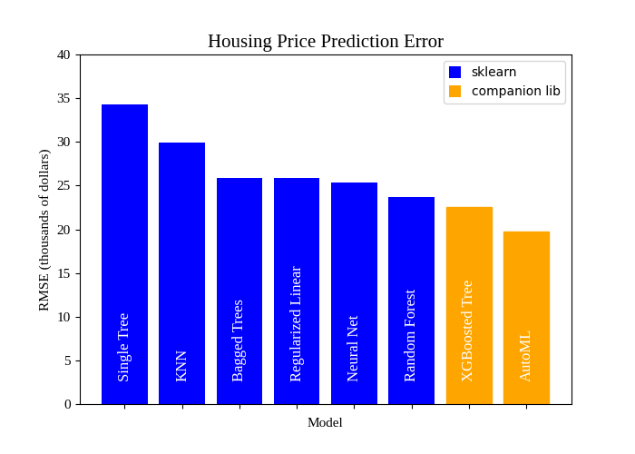
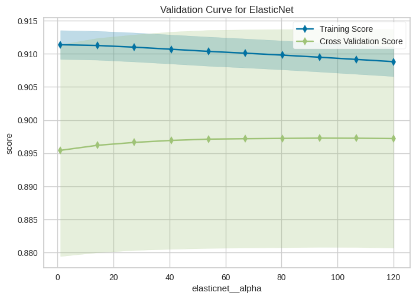

# Title
Better Modeling with Sklearn Companion Libs
# Subtitle
Create uncluttered pipelines, validate faster, and utilize additional algorithms like AutoML from the comfort of your *Sklearn* skillset

# Motivation
I found a few Sklearn insights during a machine learning deep dive last year (see Sources). An informal poll of working data scientists revealed that these are not common knowledge. 



# Preliminaries
* Insights are demonstrated on the Ames housing data set.
* The reader should have a little bit of experience with Sklearn to fully appreciate these. 

Let's get to it.

### Streamlined pipeline code with Feature Engine's **SklearnTransformWrapper**

After ingestion and creating a train-test split, we construct preprocessing recipes called **Pipelines** to automate our preprocessing steps such as scaling and one-hot encoding. These are easy to read and share, while also guarding against subtle data leakage during K-Fold validation. E.g. If a feature is scaled before creating the train-test split, this results in leakage.

Feature Engine's *SklearnTransformWrapper* wraps our StandardScaler() and OneHotEncoder() so that we can put them directly into our Pipeline object. No more ColumnTransformer. Data exits each step as a dataframe so that we don't need to fumble with numpy ndarrays, which are returned by default from many Sklearn transformers.

The Sklearn helper method *make_pipeline* names the steps so that our GridSearchCV object can talk to our pipeline. 
Just query the step names with `pipe.named_steps`. For this example it tells us that our estimator is called 'elasticnet'.

GridSearchCV tunes the hyperparameters through the name of each step. E.g. 'elasticnet__alpha' sends the list of values in *alpha_range* to the ElasticNet model at the end of our pipeline.

```
# skipping typical sklearn imports and dataframe creation 

from feature_engine.wrappers import SklearnTransformerWrapper

categoric_cols = X_train.select_dtypes(include=object).columns.tolist()

std_scaler = SklearnTransformerWrapper(transformer=StandardScaler())
OH_encoder = SklearnTransformerWrapper(transformer=OneHotEncoder(
    sparse_output=False, 
    drop='if_binary', 
    min_frequency=0.1, 
    handle_unknown='ignore'), 
    variables=categoric_cols)

pipe = make_pipeline(std_scaler, OH_encoder, ElasticNet(max_iter=2000))
alpha_range = np.linspace(70, 150, num=20)
gs = GridSearchCV(n_jobs=3, estimator=pipe, cv=10, scoring='neg_root_mean_squared_error', param_grid={
                  'elasticnet__l1_ratio': [0.7, 0.8, 0.9, 1.0], 'elasticnet__alpha': alpha_range})
```

### Fast and pretty model validation plots with Yellowbrick

*Yellowbrick* has helper classes and functions to automatically create various important graphics and keep our thinking (mostly) up above the matplotlib api.**

Your hyperparameter search with GridSearchCV may have covered multiple parameters. Choose one and validate it with Yellowbrick's **ValidationCurve**. 

```
# Create validation curve to increase confidence that algorithm is performing reasonably
pipe_validation = make_pipeline(
    std_scaler, OH_encoder, ElasticNet(l1_ratio=1.0, max_iter=2000))

# Yellowbrick magic. Similar to GridSearchCV on a single parameter, but with a plot produced.
viz = ValidationCurve(
    pipe_validation, cv=10, param_name='elasticnet__alpha', param_range=alpha_range
)

# Fit and show the visualizer
viz.fit(X_train, y_train)
viz.show()
```




### Add AutoML and Extreme Gradient Boosting to your algorithm toolbox with AutoSklearn and XGBoost
Sklearn has a range of estimators including regularized regression, support vector machine, single decision trees, bagged trees, boosted trees, and deep neural nets. We can add XGBoost and AutoML functionality by importing a single package for each.

```
# ... sklearn imports, create onehot encoder transform, create dataframes ...
from xgboost import XGBRegressor

categoric_cols = X_train.select_dtypes(include=object).columns.tolist()
OH_encoder = SklearnTransformerWrapper(transformer=OneHotEncoder(
    sparse_output=False, drop='if_binary', min_frequency=0.1, handle_unknown='ignore'), variables=categoric_cols)

# Being a companion library, the XGBRegressor can be used inside a pipeline object just like a built in estimator
pipe = make_pipeline(OH_encoder, XGBRegressor(
    booster='gbtree', n_jobs=2, random_state=42))


# scan the number of trees and tree depth parameters for optimal values
num_trees_range = np.int64(np.linspace(200, 400.0, num=5))
depth_range = [1, 2, 3, 4]
gs = GridSearchCV(n_jobs=8, estimator=pipe, cv=10,
                  scoring='neg_root_mean_squared_error', param_grid={'xgbregressor__max_depth': depth_range,
                                                                     'xgbregressor__n_estimators': num_trees_range})
```

Auto-sklearn is a package that implements an 'automl' algorithm. Note that there are several different algorithms and really the term is an umbrella term for machine learning that requires very little user input. We don't want to give the impression it is a panacea, because it is not. In some instances it may shift the analyst's effort to the feature engineering phase, and in others it may produce a model with too much complexity for a given use case. 

```
# .. typical sklearn and other data science imports ... 
# Commonly occuring pthread errors with auto-sklearn are fixed by these two lines.
import os
os.environ['OPENBLAS_NUM_THREADS'] = '1'                    # DONT ASK 
from autosklearn.metrics import root_mean_squared_error
from sklearn.metrics import mean_squared_error
import autosklearn.regression

# On the Ames dataset, the settings below dataset generate an ensemble 
# of LinearSVR and AdaBoost models that outperforms 
# our best manually-obtained model.

# By default, auto-sklearn trains for 1 hour and outputs the best model
# that it found.

# Below is a control block to save the model to a .pkl file so that 
# we do not have to re-run a lengthy training session over and over
# while we tweak our notebook.

automl = {}
filename_automl = "saved_model_automl.pkl"

X_train, X_test, y_train, y_test = make_train_test()

if os.path.exists(filename_automl):
    automl = joblib.load(filename=filename_automl)
else:
    categoricals = X_train.select_dtypes(object).columns.tolist()
    X_train[categoricals] = X_train.select_dtypes(
        object).astype('category')
    scorer = root_mean_squared_error

    automl = autosklearn.regression.AutoSklearnRegressor(metric=scorer)
    automl.fit(X_train, np.float64(y_train.to_numpy()))

    joblib.dump(automl, filename=filename_automl, compress=6)

y_hat = automl.predict(X_test)
rmse = mean_squared_error(y_test, y_hat, squared=False)
```

### Place ingestion and feature engineering code in an ingestion script  
Hopefully obvious by now, but place your code that produces ready-to-model pandas dataframes into a script like **ingestion.py** and call it from all your notebooks and scripts. Good names for this function are "make_frames" and "make_cleaned". This way, ingestion or feature engineering code only needs to be changed in one place. Dependent code can simply be re-executed. 

### Conclusion
Hopefully these tips will help you save some time or write some cleaner code for your next data science project. 

# Companion lib review
* Feature-Engine - provides tranformers that can be easier to use than the Sklearn defaults, reducing boilerplate and tightening up pipelines
* Yellowbrick - provides wrappers over estimators to make common visualizations quickly
* XGBoost - provides an additional (and widely popular) gradient boosting implementation
* AutoSklearn - provides AutoML functionality

# Sources 
1. Georgetown Data Science Certificate Program
1. Hands-on Machine Learning with R book, Boehmke and Greenwell
1. Vectors Matrices and Least Squares book, Boyd and Vandenberghe
1. ThinkStats, Allen Downey
1. API docs and code for the various libraries Sklearn, Xgboost, AutoSklearn, Numpy, Pandas
